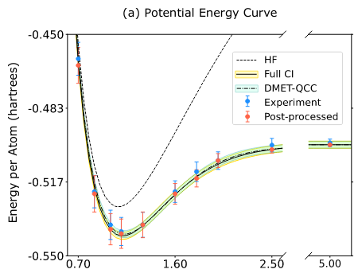

.. raw:: html

   

     
   

.. raw:: html

   

     
     
     
   

.. |build| image:: https://github.com/goodchemistryco/Tangelo/actions/workflows/continuous_integration.yml/badge.svg
   :target: https://github.com/goodchemistryco/Tangelo/actions/workflows/continuous_integration.yml

Tangelo is an open-source Python package maintained by `SandboxAQ <https://www.sandboxaq.com/>`_, focusing on the development of quantum chemistry simulation workflows on quantum computers. It was developed as an engine to accelerate research, and takes advantage of other popular frameworks to harness the innovation in our field.

-------------

.. raw:: html

   <h3 align="center"> 
     <a href="https://github.com/goodchemistryco/Tangelo-Examples/blob/main/contents.rst" target="_blank"><b>Tutorials</b></a>
   &nbsp;&#183;&nbsp;
     <a href="https://github.com/goodchemistryco/Tangelo/blob/develop/docs/source/docs/source/_static/img/tangelo_feature_overview.jpeg?raw=true" target="_blank"><b>Features</b></a>
   &nbsp;&#183;&nbsp;
     <a href="https://sandbox-quantum.github.io/Tangelo/overview.html" target="_blank"><b>Docs</b></a>
   &nbsp;&#183;&nbsp;
     <a href="https://goodchemistry.com/blog/" target="_blank"><b>Blog</b></a>
   </h3>

-------------

This package provides a collection of algorithms and toolboxes to support quantum algorithms R&D and the design of successful experiments on quantum devices. Tangelo is backend-agnostic, which means users can write quantum algortihms once and run their calculations on current and future platforms with minimal changes. Tangelo is capable to perform quantum experiments that led to publications in scientific journals, co-authored by professionals from the chemical industry and quantum hardware manufacturers.

.. raw:: html

   

     
   

-----------------------------

Install
-------

1. Using pip
^^^^^^^^^^^^

The easiest way to install Tangelo in your local environment.

.. code-block::

   python -m pip install --upgrade pip.
   pip install tangelo-gc

If you'd like to install via pip the code in a specific branch of this Github repository (let's say ``develop``, which is usually the most advanced):

.. code-block::

   pip install git+https://github.com/goodchemistryco/Tangelo.git@develop

2. From source, using setuptools
^^^^^^^^^^^^^^^^^^^^^^^^^^^^^^^^

After downloading the contents of this repo, you can install Tangelo using the following command, which uses ``setup.py``:

.. code-block::

   python -m pip install .

Optional dependencies: Quantum Simulators and Classical Quantum Chemistry
^^^^^^^^^^^^^^^^^^^^^^^^^^^^^^^^^^^^^^^^^^^^^^^^^^^^^^^^^^^^^^^^^^^^^^^^^

Tangelo enables users to target various backends. In particular, it integrates quantum circuit simulators such as ``qulacs``\ , ``qiskit``\ , ``cirq``, among others. We leave it to you to install the packages of your choice, and refer to their own documentation. Most packages can be installed through pip or conda easily.
Tangelo can be used without having a classical quantum chemistry package installed but many chemistry algorithms need one. The two quantum chemistry packages that are natively supported are `PySCF <https://pyscf.org/>`_ and `Psi4 <https://psicode.org/>`_, which can be installed through pip or conda. It is possible to plug in your own pre-computed integrals and other chemistry calculations done with the tools of your choice, or your own compute backend for executing quantum algorithms.

Optional: environment variables
^^^^^^^^^^^^^^^^^^^^^^^^^^^^^^^

The bash file ``env_var.sh`` shows a number of environment variables used in Tangelo, for purposes such as computational performance or credentials for quantum experiments.
You can either source this file in your terminal, or set these variables inside your python script / notebooks using the ``os`` package.

Tutorials and examples
----------------------

We have a `dedicated repository <https://github.com/goodchemistryco/Tangelo-Examples>`_ for examples and tutorials ! You can get started with just a few clicks.
Tutorials are organized following a colorful tag system to help people find what is relevant to them. They contain insightful information and advice about chemistry simulations, quantum computing experiments and using Tangelo. Tangelo users can also contribute to this repository and showcase their own work.

Check out our `tutorials <./TUTORIALS.rst>`_ file for more details.

Tests
-----

Unit tests can be found in the ``tests`` folders, located in the various toolboxes they are related to. To automatically find and run all tests (some tests will fail or be skipped if a dependency is not installed):

.. code-block::

   python -m unittest

Contributions
-------------

Thank you very much for considering contributing to this project; we'd love to have you on board !
You do not need to be a seasoned software developer or expert in your field to make contributions to this project: it will take various kinds of people and backgrounds to tackle the challenges that await us.

You can use the `Issue tab <https://github.com/goodchemistryco/Tangelo/issues>`_ to open a bug report or feature request. Starting a discussion in the `Discussion tab <https://github.com/goodchemistryco/Tangelo/discussions>`_ is also a good start: we'll figure it out from there.

The contribution process is detailed in the `contributions <./CONTRIBUTIONS.rst>`_ file. Don't feel intimidated: we work at the intersection of many difficult fields and we're here to help. By joining the Tangelo community and sharing your ideas and developments, you are creating an opportunity for us to grow together, and take ideas to the finish line and beyond.

Citations
---------

If you use Tangelo in your research, please cite the `Tangelo release paper <https://arxiv.org/abs/2206.12424>`_ and consider mentioning Tangelo in your talks.

.. code-block:: latex

   @article{tangelo,
      author = {Valentin Senicourt and James Brown and Alexandre Fleury and Ryan Day and Erika Lloyd and Marc P. Coons and Krzysztof Bieniasz and Lee Huntington and Alejandro J. Garza and Shunji Matsuura and Rudi Plesch and Takeshi Yamazaki and Arman Zaribafiyan},
      title = {Tangelo: An Open-source Python Package for End-to-end Chemistry Workflows on Quantum Computers},
      year = {2022},
      url= {https://arxiv.org/abs/2206.12424},
      number = {arXiv:2206.12424},
      eprint = {arXiv:2206.12424},
      publisher = {{arXiv}},
      doi = {10.48550/arXiv.2206.12424}
   }

© SandboxAQ 2024. This software is released under the Apache Software License version 2.0.
