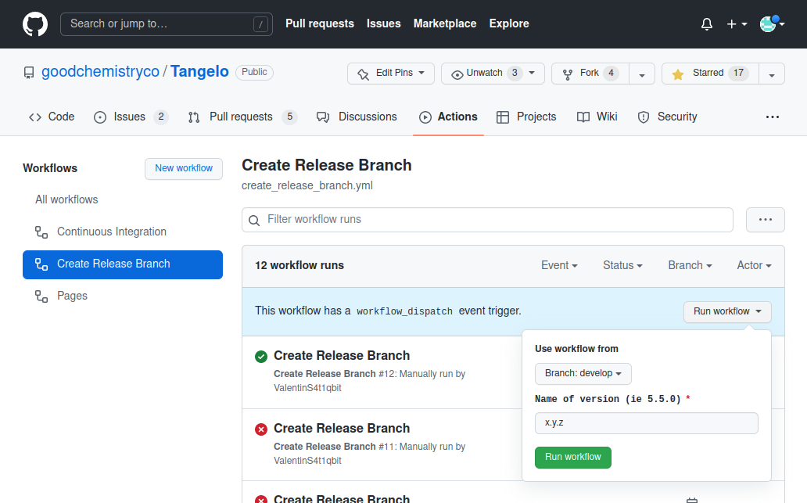
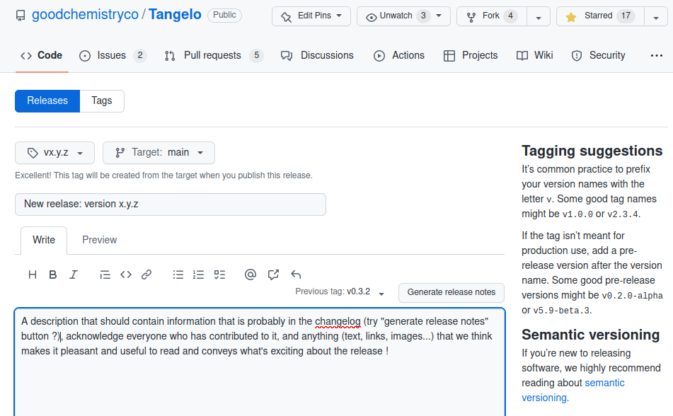

Release guide
=============

This document is here to assist project maintainers in creating and deploying new releases on Github and pypi.
It covers the processes of bumping the main branch to a new version number, ensuring the develop branch catches up, and
then creating and deploying new releases on Github and pypi (pip). All of these steps take place on the public repo.

In order to complete the steps of this release process, you must have adequate permissions on Github, and pypi.
If you're not sure you have them, reach out to project maintainers and owners BEFORE you start doing anything.

 In the following, we assume that the project is to be bumped to a new version number x.y.z, that reflects the progress that
 was made in the project since the previous release, and has been already agreed on by maintainers.

1. Bumping the main branch to the new version
----------------------------------------------

1a. Creating the release/x.y.z branch to main PR
^^^^^^^^^^^^^^^^^^^^^^^^^^^^^^^^^^^^^^^^^^^^^^^^

You can do this through an automated Github workflow/action, called `create_release_branch` at the time of writing this document.
This will create a release branch with the desired version number, and a Pull Request from the release branch into main.
To achieve this, go to the `action tab <https://github.com/goodchemistryco/Tangelo/actions/workflows/create_release_branch.yml>`_
of the project, and go through the following steps:

|release_action|

- Click the desired workflow on the left
- Click the "run workflow" button in the blue zone
- Use workflow from branch "develop"
- Enter the desired release version number
- Click the green button that reads "run workflow"

 Our workflow is defined in our repo under `.github/workflows`: it is thus versioned by git and we expect the version in develop
 to be the latest. But if you make changes to it and want to try it out, you may want to run the version of the workflow
 from your branch. It would be preferable to run workflow tests on a private version of the repo, to avoid leaving traces
 of the tests and messing up the history of the public one.

This workflow should only take a few seconds to run: stay on the action tab to make sure it appears in the log, and has
successfully completed. Feel free to explore the different steps. This should have created a `release/x.y.z` branch and a
PR attempting to merge that branch into main.

1b. Merging the release to main PR
^^^^^^^^^^^^^^^^^^^^^^^^^^^^^^^^^^

A new PR should have been created. The description tells you how it came to be, and what you should be doing.
Here's a `past example <https://github.com/goodchemistryco/Tangelo/pull/187>`_ so that you can get an idea of what it may look like.

This PR does not need to be reviewed in details: virtually all its contents are changes have already been reviewed, tested and
merged into develop. What matters is that:

- the tests passed
- the version string in `tangelo/_version.py` is as expected
- `CHANGELOG.md` has been updated (you may have to do that manually until we figure out a better way)

To update the CHANGELOG: use the PR conversation tab and trim the history down to the essentials (you can take example
on the previous entries of changelogs).

Ask someone to kindly look at the version and CHANGELOG files, and approve the PR once tests have passed.
Once the PR has been merged, main has officially been updated!

1c. Updating develop to new version number
^^^^^^^^^^^^^^^^^^^^^^^^^^^^^^^^^^^^^^^^^^

The main branch is now slightly ahead of the develop branch (version number, CHANGELOG): open a PR from main into develop.
This PR should be very small, once you fixed the conflicts. Likewise, get the tests to pass and ask for a trivial review.
Once approved, we can merge that PR and develop has caught up with main.

2. Creating a new release on Github
-----------------------------------

Notice the release section on the right part of the screen, on the github project page.
Go to the `release page <https://github.com/goodchemistryco/Tangelo/releases>`_ (you can also reach it by clicking "Releases").

|release_github|

- Click “draft a new release”
- Create a new tag (vx.y.z for the version number is usually good)
- Base this release on the main branch
- Populate the release message (changelog info, contributors, and a human-friendly message that addresses our readers).
- You do not need to attach any files to the release, github will attach a zip and a tar.gz snapshot of the main branch.

The release message can be as nice as we want it to be: announcements, roadmap, exciting news, special thanks,
pretty figures, links ... It's an opportunity to celebrate and acknowledge the contributions of everyone, and make people
excited for this new version.

 You can populate the "changelog" part manually or try the "Generate release notes" button with the tag of the previous version.

After you click the green button, the release section should now feature a new entry, with your release message, and a tar.gz and zip
snapshot of the code in main attached. You did it!

3. Creating a new release on pypi (pip)
---------------------------------------

Most of the process follows the information on `this page <https://packaging.python.org/en/latest/tutorials/packaging-projects/#generating-distribution-archives>`_.
Before proceeding, you need:

- an account on pypi with adequate privileges for this project
- a pypi token for this project (see link above)

The following steps will take place in a terminal on your personal computer. Make sure you are doing them using the latest
version of the main branch, where the release is based from (you can just work in a folder that unpacked the zip or tar.gz
archives found in the github release you have just completed).

.. code-block::

   # Create new virtualenv with version number (release_x.y.z), activate it
   python3 -m venv release_x.y.z
   source release_x.y.z/bin/activate

   # Upgrade pip and build
   python -m pip install --upgrade pip
   python -m pip install --upgrade build

   # Ensure no dist folder is present under the root folder of Tangelo
   # Create distribution files (wheel and from-source distrib), they should appear under a dist folder.
   # It seems that we do not need a pyproject.toml file and that setup.py is used.
   python -m build

   # Upload to pypi with Twine
   python3 -m pip install --upgrade twine
   python3 -m twine upload dist/*

You will be prompted for a username and password.
For the username, use __token__ (two underscores before and after).
For the password, use the token value, including the pypi- prefix (ex: pypi-s32fdg3fg2fd3....).

If successful, the release is now available on pypi!
You should try to create another fresh virtual environment and install the package with pip to make sure it works
(maybe just do a simple import and query for the version number with tangelo.__version__)

.. code-block::

   pip install tangelo-gc

Share the news with others, ask them to try installing the new version through pip in their environments: the more datapoints, the better.
We really do not want users to have issues with pip installs.

Finally, you're done! Thank you for creating a new release. If you think this release process can be made easier or improved
in general, feel free to provide feedback.

© Good Chemistry Company 2022. This software is released under the Apache Software License version 2.0.
